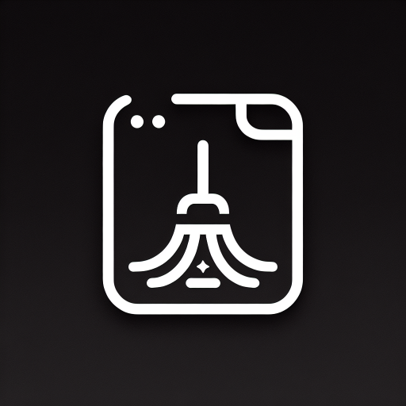

# mainonly


[Intro Page](https://nekonull.me/mainonly/)

A JavaScript bookmarklet designed to isolate and highlight a specific element on a webpage, effectively hiding all other elements.

(Created with GPT-4-turbo-1106 and refined through manual adjustments.)


## How to Use

1. Copy the following code:

    ```JavaScript
    javascript:(function(){document.getElementById("mainonly")&&document.dispatchEvent(new KeyboardEvent("keydown",{key:"Escape"}));var e=document.body,n=null;e.id?(n="class",e.classList.add("mainonly")):(n="id",e.id="mainonly");let t=document.head.appendChild(document.createElement("style"));t.textContent="#mainonly { outline: 2px solid red; }  .mainonly { outline: 2px solid red; }";let i=document.body.appendChild(document.createElement("div"));i.className="mainonly-guide",i.innerHTML=`<p>正在选择元素。按 <kbd>Esc</kbd> 键取消选择。向下滚动，或按下 <kbd>=</kbd>/<kbd>.</kbd> 键缩小选区。向上滚动，或按下 <kbd>-</kbd>/<kbd>,</kbd> 键扩大选区。</p><p>Selecting element. Press <kbd>Esc</kbd> to cancel selection. Scroll down, or press <kbd>=</kbd>/<kbd>.</kbd> to shrink the selection. Scroll up, or press <kbd>-</kbd>/<kbd>,</kbd>, to expand the selection.</p>`;let o=document.head.appendChild(document.createElement("style"));function l(t){t instanceof HTMLElement&&("id"===n?e.removeAttribute("id"):e.classList.remove("mainonly"),(e=t).id?(n="class",e.classList.add("mainonly")):(n="id",e.id="mainonly"))}function d(e){l(e.target)}function a(i){i.preventDefault(),function n(){for(var t=e;t.parentElement;)(t=t.parentElement).classList.add("mainonly_parents")}(),"id"===n?t.textContent="* { visibility: hidden; } #mainonly, #mainonly *, .mainonly_parents { visibility: visible; }":t.textContent="* { visibility: hidden; } .mainonly, .mainonly *, .mainonly_parents { visibility: visible; }",m(),r()}function r(){i.remove(),o.remove()}function s(i){if(i.preventDefault(),"Escape"===i.key)t.remove(),document.removeEventListener("keydown",s),m(),r(),"id"===n?e.removeAttribute("id"):e.classList.remove("mainonly"),function e(){for(var n=document.querySelectorAll(".mainonly_parents"),t=0;t<n.length;t++)n[t].classList.remove("mainonly_parents")}();else if(","===i.key||"-"===i.key)l(e.parentElement);else if("."===i.key||"="===i.key){var o=e.querySelector(":hover");o&&l(o)}}function c(n){if(n.preventDefault(),n.deltaY<0)l(e.parentElement);else{var t=e.querySelector(":hover");t&&l(t)}}function m(){document.removeEventListener("mouseover",d),document.removeEventListener("click",a),document.removeEventListener("wheel",c)}o.textContent=` .mainonly-guide { position: fixed; top: 0; left: 50%; /* center the box horizontally */ transform: translate(-50%, 0); /* center the box horizontally */ padding: 0.5rem; font-size: 1rem; font-family: sans-serif; text-align: center; color: white; background-color: rgba(0, 0, 0, 0.5); border-radius: 0.5em; z-index: 999999999;     kbd { display: inline-block; padding: 0.1em 0.3em; font-size: 0.8em; line-height: 1; color: #24292e; vertical-align: middle; background-color: #fafbfc; border: 1px solid #d1d5da; border-radius: 3px; box-shadow: inset 0 -1px 0 #d1d5da;     } }`,document.addEventListener("mouseover",d),document.addEventListener("click",a),document.addEventListener("wheel",c,{passive:!1}),document.addEventListener("keydown",s)}())
    ```

2. Right-click on your browser's bookmark bar and select "Add Bookmark".
3. In the pop-up window, name your bookmark (for example, "mainonly") and paste the copied code into the URL or location field.
4. Save the bookmark.
5. On a webpage, activate the bookmarklet, then click on the element you want to focus on. This element will be encircled with a red outline. Use the scroll wheel or keyboard shortcut (`-` `,` for expand, `=` `.` for shrink) to adjust the selection size.
6. Once you've made a selection, click the left mouse button. All other elements will be hidden, leaving only the selected element visible.
7. Press the `ESC` key to reveal the hidden elements and revert the page to its original state.

## Tools

- [minifier](https://www.toptal.com/developers/javascript-minifier)
- [Bookmarklet Maker](https://caiorss.github.io/bookmarklet-maker/)

## How it Works?

- The `onhover` event selects the element that is being hovered over.
- When scrolling, the parent or child node of the currently selected element is obtained.
- When clicked, the selected element is assigned an `id` or `class` attribute.
- CSS `visibility: hidden;` is used to hide the other elements.

(Or just read the [code](https://github.com/jerrylususu/mainonly/blob/main/mainonly.js) and see for yourself.)

## Is it Safe?
Yes, it is safe. The code is executed locally on the user's device and does not make any network requests. It only interacts with the webpage that is currently open in the browser.

## What are the limitations?

- In some web pages, other parts of the text content outside the selected element may still be visible. (This issue only occurs when the selected element already has an `id` attribute; it is a limitation of the browser itself and currently has no solution.)

---

[介绍页面](https://nekonull.me/mainonly/)

一个 JavaScript 书签工具，专门用于隐藏网页上的非目标元素，仅显示您想要聚焦的元素。

（基于 GPT-4-turbo-1106 创制，并经过手动优化调整。）

## 使用方法

1. 复制以下代码：

    ```JavaScript
    javascript:(function(){document.getElementById("mainonly")&&document.dispatchEvent(new KeyboardEvent("keydown",{key:"Escape"}));var e=document.body,n=null;e.id?(n="class",e.classList.add("mainonly")):(n="id",e.id="mainonly");let t=document.head.appendChild(document.createElement("style"));t.textContent="#mainonly { outline: 2px solid red; }  .mainonly { outline: 2px solid red; }";let i=document.body.appendChild(document.createElement("div"));i.className="mainonly-guide",i.innerHTML=`<p>正在选择元素。按 <kbd>Esc</kbd> 键取消选择。向下滚动，或按下 <kbd>=</kbd>/<kbd>.</kbd> 键缩小选区。向上滚动，或按下 <kbd>-</kbd>/<kbd>,</kbd> 键扩大选区。</p><p>Selecting element. Press <kbd>Esc</kbd> to cancel selection. Scroll down, or press <kbd>=</kbd>/<kbd>.</kbd> to shrink the selection. Scroll up, or press <kbd>-</kbd>/<kbd>,</kbd>, to expand the selection.</p>`;let o=document.head.appendChild(document.createElement("style"));function l(t){t instanceof HTMLElement&&("id"===n?e.removeAttribute("id"):e.classList.remove("mainonly"),(e=t).id?(n="class",e.classList.add("mainonly")):(n="id",e.id="mainonly"))}function d(e){l(e.target)}function a(i){i.preventDefault(),function n(){for(var t=e;t.parentElement;)(t=t.parentElement).classList.add("mainonly_parents")}(),"id"===n?t.textContent="* { visibility: hidden; } #mainonly, #mainonly *, .mainonly_parents { visibility: visible; }":t.textContent="* { visibility: hidden; } .mainonly, .mainonly *, .mainonly_parents { visibility: visible; }",m(),r()}function r(){i.remove(),o.remove()}function s(i){if(i.preventDefault(),"Escape"===i.key)t.remove(),document.removeEventListener("keydown",s),m(),r(),"id"===n?e.removeAttribute("id"):e.classList.remove("mainonly"),function e(){for(var n=document.querySelectorAll(".mainonly_parents"),t=0;t<n.length;t++)n[t].classList.remove("mainonly_parents")}();else if(","===i.key||"-"===i.key)l(e.parentElement);else if("."===i.key||"="===i.key){var o=e.querySelector(":hover");o&&l(o)}}function c(n){if(n.preventDefault(),n.deltaY<0)l(e.parentElement);else{var t=e.querySelector(":hover");t&&l(t)}}function m(){document.removeEventListener("mouseover",d),document.removeEventListener("click",a),document.removeEventListener("wheel",c)}o.textContent=` .mainonly-guide { position: fixed; top: 0; left: 50%; /* center the box horizontally */ transform: translate(-50%, 0); /* center the box horizontally */ padding: 0.5rem; font-size: 1rem; font-family: sans-serif; text-align: center; color: white; background-color: rgba(0, 0, 0, 0.5); border-radius: 0.5em; z-index: 999999999;     kbd { display: inline-block; padding: 0.1em 0.3em; font-size: 0.8em; line-height: 1; color: #24292e; vertical-align: middle; background-color: #fafbfc; border: 1px solid #d1d5da; border-radius: 3px; box-shadow: inset 0 -1px 0 #d1d5da;     } }`,document.addEventListener("mouseover",d),document.addEventListener("click",a),document.addEventListener("wheel",c,{passive:!1}),document.addEventListener("keydown",s)}())
    ```

2. 右键点击您的浏览器书签栏，选择“添加书签”。
3. 在弹出的窗口中，为书签命名（例如：“mainonly”），并将复制的代码粘贴到 URL 或位置栏中。
4. 保存书签。
5. 在网页上，激活书签后，点击您想要关注的元素。该元素将被红色轮廓圈出。使用滚轮或键盘快捷键（`-` `,` 扩大, `=` `.` 缩小）调整选择范围。
6. 选定元素后，点击鼠标左键，其他所有元素将被隐藏，只显示所选元素。
7. 按 `ESC` 键可显示隐藏的元素，并恢复网页至原始状态。

## 工具
- [minifier （代码压缩工具）](https://www.toptal.com/developers/javascript-minifier)
- [Bookmarklet Maker （小书签制作工具）](https://caiorss.github.io/bookmarklet-maker/)


## 工作原理

- `onhover` 事件选择被悬停的元素。
- 滚动时，获取当前选定元素的父节点或子节点。
- 点击时，为选定的元素分配 `id` 或 `class` 属性。
- 使用 CSS 的 `visibility: hidden;` 来隐藏其他元素。

（或者直接阅读[代码](https://github.com/jerrylususu/mainonly/blob/main/mainonly.js)。）

## 是否安全？

是的，它是安全的。该代码在用户设备上本地执行，不会进行任何网络请求。它只与当前在浏览器中打开的网页进行交互。

## 有什么限制？

- 部分网页中，选中元素之外的其他部分文本内容依然可见。（此问题仅在被选中的元素已有 `id` 属性时出现；这是浏览器本身的限制，暂时没有解决方案。）
