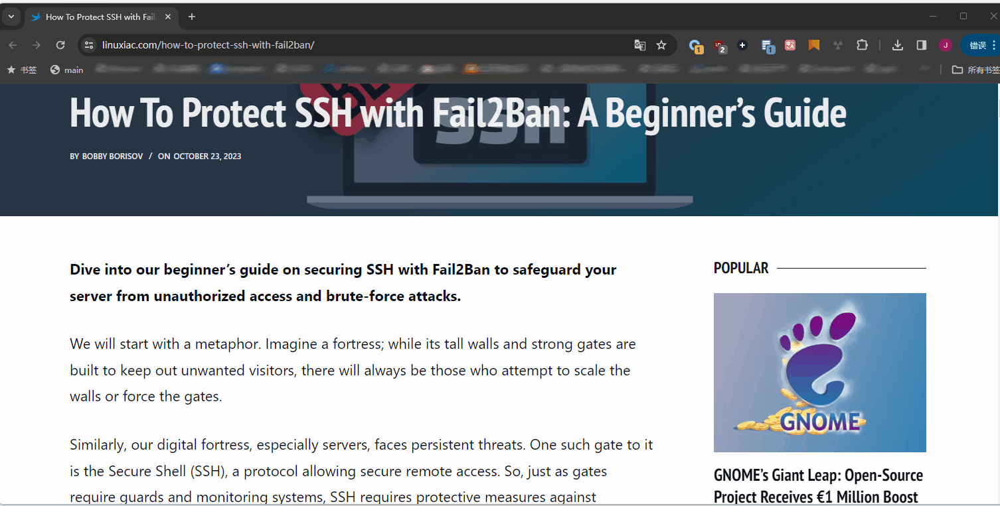

# mainonly

A JavaScript bookmarklet designed to isolate and highlight a specific element on a webpage, effectively hiding all other elements.

(Created with GPT-4-turbo-1106 and refined through manual adjustments.)



## How to Use

1. Copy the following code:

    ```JavaScript
    javascript:(function(){var e=document.body;let n=document.head.appendChild(document.createElement("style"));n.textContent=".mainonly { outline: 2px solid red; }";let t=CSS.supports("selector(:has(*))");function o(n){n instanceof HTMLElement&&(e.classList.remove("mainonly"),(e=n).classList.add("mainonly"))}function i(e){o(e.target)}function l(o){if(o.preventDefault(),t)n.textContent=":not(:has(.mainonly), .mainonly, .mainonly *) { visibility: hidden; }";else{n.textContent=":not(.mainonly *, .mainonly-ancestor) { visibility: hidden; }";var i=e;do i.classList.add("mainonly-ancestor");while(i=i.parentElement)}r()}function s(o){if("Escape"===o.key){o.preventDefault();var i=window.scrollY||document.documentElement.scrollTop;if(n.remove(),document.removeEventListener("keydown",s),r(),e?.classList.remove("mainonly"),!t)for(let l of document.getElementsByClassName("mainonly-ancestor"))l.classList.remove("mainonly-ancestor");window.scrollTo(0,i)}}function a(n){n.preventDefault(),n.deltaY<0?o(e.parentElement):o(e.firstElementChild)}function r(){document.removeEventListener("mouseover",i),document.removeEventListener("click",l),document.removeEventListener("wheel",a)}document.addEventListener("mouseover",i),document.addEventListener("click",l),document.addEventListener("wheel",a,{passive:!1}),document.addEventListener("keydown",s)}())
    ```

2. Right-click on your browser's bookmark bar and select "Add Bookmark".
3. In the pop-up window, name your bookmark (for example, "mainonly") and paste the copied code into the URL or location field.
4. Save the bookmark.
5. On a webpage, activate the bookmarklet, then click on the element you want to focus on. This element will be encircled with a red outline. Use the scroll wheel to adjust the selection size.
6. Once you've made a selection, click the left mouse button. All other elements will be hidden, leaving only the selected element visible.
7. Press the `ESC` key to reveal the hidden elements and revert the page to its original state.

## Tools

- [minifier](https://www.toptal.com/developers/javascript-minifier)
- [Bookmarklet Maker](https://caiorss.github.io/bookmarklet-maker/)

---

一个 JavaScript 书签工具，专门用于隐藏网页上的非目标元素，仅显示您想要聚焦的元素。

（基于 GPT-4-turbo-1106 创制，并经过手动优化调整。）

## 使用方法

1. 复制以下代码：

    ```JavaScript
    javascript:(function(){var e=document.body;let n=document.head.appendChild(document.createElement("style"));n.textContent=".mainonly { outline: 2px solid red; }";let t=CSS.supports("selector(:has(*))");function o(n){n instanceof HTMLElement&&(e.classList.remove("mainonly"),(e=n).classList.add("mainonly"))}function i(e){o(e.target)}function l(o){if(o.preventDefault(),t)n.textContent=":not(:has(.mainonly), .mainonly, .mainonly *) { visibility: hidden; }";else{n.textContent=":not(.mainonly *, .mainonly-ancestor) { visibility: hidden; }";var i=e;do i.classList.add("mainonly-ancestor");while(i=i.parentElement)}r()}function s(o){if("Escape"===o.key){o.preventDefault();var i=window.scrollY||document.documentElement.scrollTop;if(n.remove(),document.removeEventListener("keydown",s),r(),e?.classList.remove("mainonly"),!t)for(let l of document.getElementsByClassName("mainonly-ancestor"))l.classList.remove("mainonly-ancestor");window.scrollTo(0,i)}}function a(n){n.preventDefault(),n.deltaY<0?o(e.parentElement):o(e.firstElementChild)}function r(){document.removeEventListener("mouseover",i),document.removeEventListener("click",l),document.removeEventListener("wheel",a)}document.addEventListener("mouseover",i),document.addEventListener("click",l),document.addEventListener("wheel",a,{passive:!1}),document.addEventListener("keydown",s)}())
    ```

2. 右键点击您的浏览器书签栏，选择“添加书签”。
3. 在弹出的窗口中，为书签命名（例如：“mainonly”），并将复制的代码粘贴到 URL 或位置栏中。
4. 保存书签。
5. 在网页上，激活书签后，点击您想要关注的元素。该元素将被红色轮廓圈出。使用滚轮调整选择范围。
6. 选定元素后，点击鼠标左键，其他所有元素将被隐藏，只显示所选元素。
7. 按 `ESC` 键可显示隐藏的元素，并恢复网页至原始状态。


# mainonlyRevert
mainonlyRevert is a JavaScript bookmarklet specially designed for web browsers. It allows highlighting and manipulating HTML elements on a webpage, providing intuitive navigation and interaction with page elements. Users can select and highlight any element on the page through mouse hover, click, and scroll wheel actions, while hiding non-target elements. Also, the page automatically returns to the previous scroll position after canceling the highlight, allowing users to quickly return to their original browsing state.

# Features:
   - When the user hovers the mouse over any element on the page, that element will be highlighted.
   - Clicking on any element hides other elements on the page, displaying only the selected element and its child elements.
   - Use the mouse wheel to switch between the selected element's parent element and the first child element.
   - Press the `Escape` key to cancel the highlight, return the page to normal state, while remaining at the previous scroll position.

# How to use
1. Copy the following code:
```
javascript:(function(){var e=document.body,currentScrollPosition,n=document.head.appendChild(document.createElement("style"));n.textContent=".mainonly { outline: 2px solid red; }";const t=CSS.supports("selector(:has(*))");function o(target){if(target instanceof HTMLElement){e.classList.remove("mainonly");currentScrollPosition=window.scrollY;(e=target).classList.add("mainonly")}}function s(event){o(event.target);event.stopPropagation()}function a(event){event.preventDefault();if(t){n.textContent=":not(:has(.mainonly), .mainonly, .mainonly *) { visibility: hidden; }"}else{n.textContent=":not(.mainonly *, .mainonly-ancestor) { visibility: hidden; }";var s=e;do{s.classList.add("mainonly-ancestor")}while(s=s.parentElement)}l()}function i(event){event.preventDefault();event.deltaY<0?o(e.parentElement):o(e.firstElementChild)}function l(){document.removeEventListener("mouseover",s),document.removeEventListener("click",a),document.removeEventListener("wheel",i)}document.addEventListener("mouseover",s),document.addEventListener("click",a),document.addEventListener("wheel",i,{passive:!1}),document.addEventListener("keydown",function(event){"Escape"===event.key&&(n.remove(),document.removeEventListener("keydown",arguments.callee),l(),e.classList.remove("mainonly"),!t&&Array.from(document.getElementsByClassName("mainonly-ancestor")).forEach(function(e){e.classList.remove("mainonly-ancestor")}),window.scrollTo(0,currentScrollPosition))})}());
```
2. Right-click on your browser's bookmark bar and select "Add Bookmark".

3. In the pop-up window, name the bookmark (e.g., “mainonlyRevert”) and paste the copied code into the URL or location field.

4. Save the bookmark.

5. On a webpage, activate the bookmark and click on the element you want to focus on. The element will be outlined in red. Use the scroll wheel to adjust the selection range. Upward scrolling selects the parent element, and downward scrolling selects the first child element.

6. After selecting an element, click the left mouse button. All other elements will be hidden, showing only the selected element, while maintaining the page layout.

7. Press the ESC key to display the hidden elements and restore the webpage to its original state, while remaining at the previous scroll position.

# Acknowledgments
mainonlyRevert is derived from jerrylususu's mainonly, modified by ChatGPT-4.
```
https://github.com/jerrylususu/mainonly
```
# mainonlyRevert
mainonlyRevert 是一个专门设计用于网页浏览器的 JavaScript 书签小程序。它能够突出显示和操作网页中的 HTML 元素，提供直观的页面元素导航和互动功能。通过鼠标悬停、点击和滚轮操作，用户可以选择和突出显示页面上的任何元素，同时隐藏非目标元素。且在取消突出显示后，页面会自动回到之前的滚动位置，便于用户快速返回到原先的浏览状态。

# 功能：
   - 当用户将鼠标悬停在页面上的任何元素上时，该元素会被突出显示。
   - 点击任意元素会隐藏页面上的其他元素，仅显示选中的元素及其子元素。
   - 使用鼠标滚轮可以在选中的元素的父元素和第一个子元素之间切换。
   - 按下 `Escape` 键取消突出显示，恢复页面到正常状态，并将保持原始位置。

# 使用方法
1. 复制以下代码：
```
javascript:(function(){var e=document.body,currentScrollPosition,n=document.head.appendChild(document.createElement("style"));n.textContent=".mainonly { outline: 2px solid red; }";const t=CSS.supports("selector(:has(*))");function o(target){if(target instanceof HTMLElement){e.classList.remove("mainonly");currentScrollPosition=window.scrollY;(e=target).classList.add("mainonly")}}function s(event){o(event.target);event.stopPropagation()}function a(event){event.preventDefault();if(t){n.textContent=":not(:has(.mainonly), .mainonly, .mainonly *) { visibility: hidden; }"}else{n.textContent=":not(.mainonly *, .mainonly-ancestor) { visibility: hidden; }";var s=e;do{s.classList.add("mainonly-ancestor")}while(s=s.parentElement)}l()}function i(event){event.preventDefault();event.deltaY<0?o(e.parentElement):o(e.firstElementChild)}function l(){document.removeEventListener("mouseover",s),document.removeEventListener("click",a),document.removeEventListener("wheel",i)}document.addEventListener("mouseover",s),document.addEventListener("click",a),document.addEventListener("wheel",i,{passive:!1}),document.addEventListener("keydown",function(event){"Escape"===event.key&&(n.remove(),document.removeEventListener("keydown",arguments.callee),l(),e.classList.remove("mainonly"),!t&&Array.from(document.getElementsByClassName("mainonly-ancestor")).forEach(function(e){e.classList.remove("mainonly-ancestor")}),window.scrollTo(0,currentScrollPosition))})}());
```
2. 右键点击您的浏览器书签栏，选择“添加书签”。

3. 在弹出的窗口中，为书签命名（例如：“mainonlyRevert”），并将复制的代码粘贴到 URL 或位置栏中。

4. 保存书签。

5. 在网页上，激活书签后，点击您想要关注的元素。该元素将被红色轮廓圈出。使用滚轮调整选择范围。

6. 选定元素后，点击鼠标左键，其他所有元素将被隐藏，只显示所选元素，同时保持页面布局。

7. 按 ESC 键可显示隐藏的元素，并恢复网页至原始状态，且还是之前的位置。

# 鸣谢
mainonlyRevert源自jerrylususu的mainonly，经过ChatGPT-4修改而成。
```
https://github.com/jerrylususu/mainonly
```
